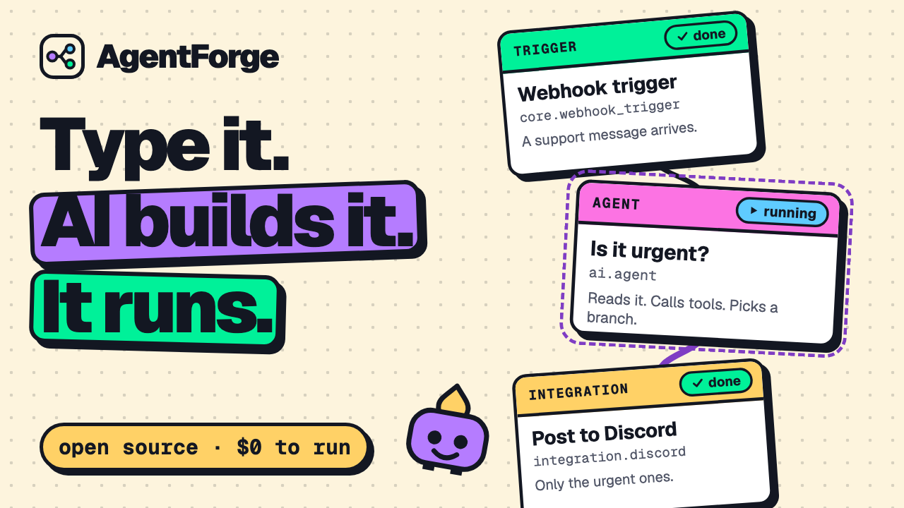
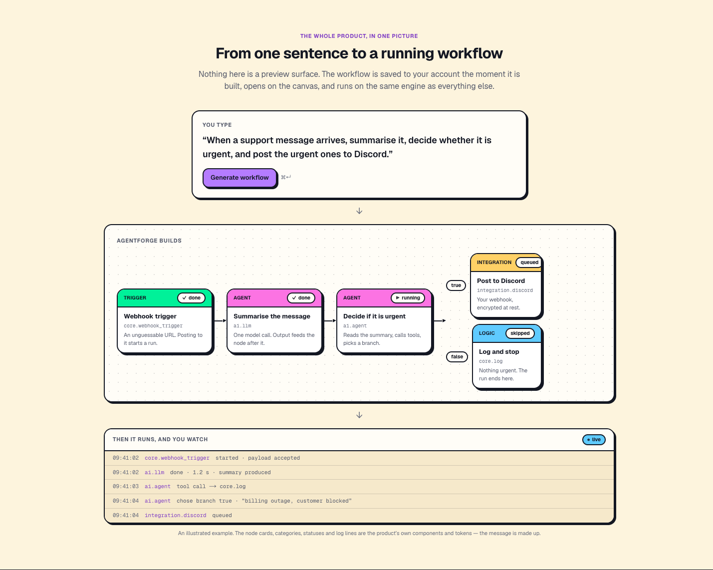
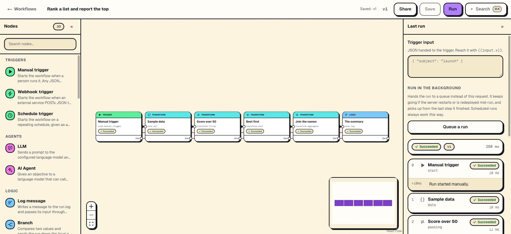
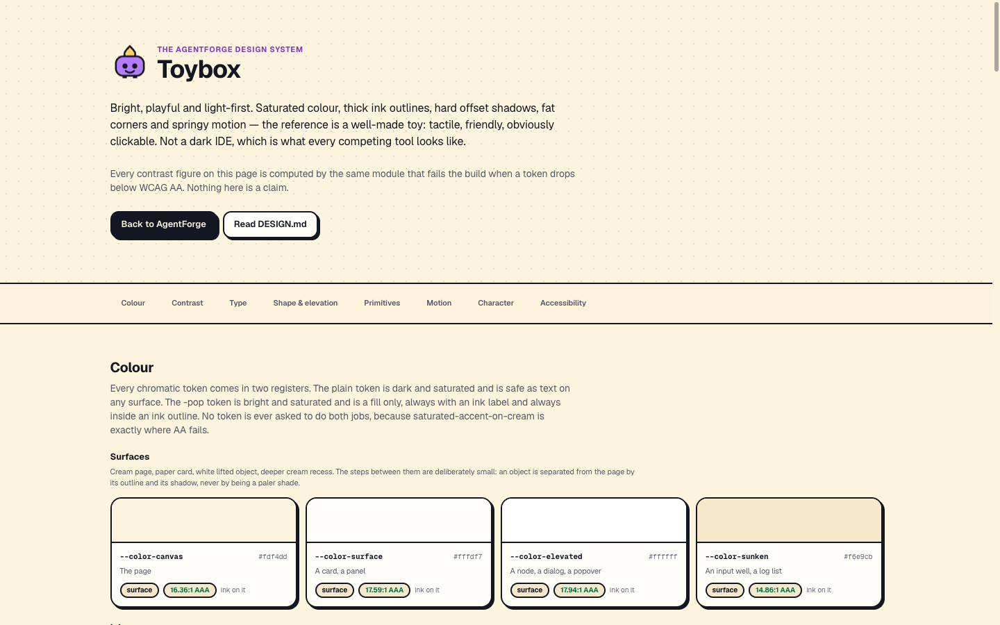
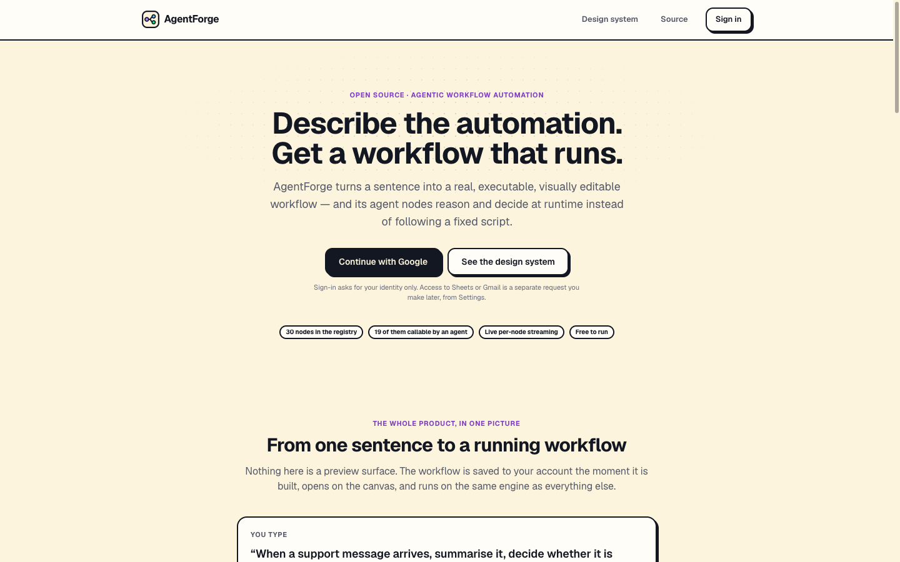

<div align="center">

<picture>
  <source media="(prefers-color-scheme: dark)" srcset="./public/illustrations/mascot-happy-dark.svg" />
  
</picture>

# AgentForge

**Describe the automation. Get a workflow that runs.**

*n8n, but the workflows are built and driven by AI agents rather than hand-wired by you.*

[](https://github.com/arunishrajput/AgentForge/actions/workflows/ci.yml)
[](./LICENSE)
[](./package.json)
[](./docs/nodes.md)
[](./docs/self-hosting.md)

**[Live app](https://agentforge-733000675212.asia-southeast1.run.app)** ·
**[Design system](https://agentforge-733000675212.asia-southeast1.run.app/design)** ·
**[Docs](./docs)** ·
**[Demo video](https://www.youtube.com/watch?v=3txmpCPEWd4)**

</div>

---

Type a sentence. AgentForge produces a **real, executable, visually editable workflow** — nodes,
connections, editable configuration — not a mockup and not a suggestion. It runs, it streams
per-node status and logs live, and its **agent nodes call other nodes as tools and decide what to
do at runtime** instead of following a fixed script.

<p align="center">
  <a href="https://www.youtube.com/watch?v=3txmpCPEWd4"></a>
  <br />
  <em>The 1:46 demo: one sentence becomes a workflow, it runs, and the agent picks the branch. <a href="https://www.youtube.com/watch?v=3txmpCPEWd4">Watch on YouTube</a></em>
</p>

<picture>
  <source media="(prefers-color-scheme: dark)" srcset="./docs/assets/workflow-demo-dark.png" />
  
</picture>

---

## What makes it different

**The node registry is the agent's tool set.** Not a parallel list of tool definitions kept in
sync by hand — the *same* objects. One registry entry feeds three consumers:

```
                  ┌──────────────────────┐
                  │   the node registry  │   36 nodes, one object each
                  └──────────┬───────────┘
            ┌────────────────┼────────────────┐
            ▼                ▼                ▼
    engine dispatch    canvas palette    agent tool set
```

So adding an integration widens what the agent can do, what the generator can produce, and what
the palette offers — in one place, with no drift. Phase 23C added the Postgres node and wrote **no
route, no settings card, no rotation rule and no vault entry**.

It is also the security boundary: **the agent can reach registered nodes and nothing else.** No
shell, no filesystem, no arbitrary network, and no arbitrary code execution anywhere in the
product — not sandboxed, not behind a flag.

**A valid graph can still be the wrong graph.** Generation is a first draft you correct, not an
oracle — which is why the canvas is editable and why the product says so out loud rather than
pretending otherwise.

<picture>
  <source media="(prefers-color-scheme: dark)" srcset="./docs/assets/canvas-run-dark.jpg" />
  
</picture>

<p align="center"><em>A real run on the deployed app — six nodes, each reporting as it finished, and the per-step log beside them.</em></p>

---

## Features

| | |
|---|---|
| **Sentence → workflow** | A validated graph, or an honest `unsupported` with a reason. A broken workflow is never saved — the generator does not touch the database |
| **A copilot that edits** | *"Also post the urgent ones to Slack"* changes the workflow on the canvas — as a **proposal**, shown as a diff with every value it sets, applied only when you press Accept, and undone with one ⌘Z. Refine it in plain words. It proposes only registry nodes, and the steps it did not touch stay exactly where you put them |
| **…that explains and repairs** | *Explain this workflow* walks through it a sentence per step — press one and its step is ringed on the canvas. *Why did this run fail?* reads the failed run, says what went wrong and where, and drafts the fix as an ordinary proposal; once you accept it, it saves and retries from the failed step — or re-runs, when the fix changed a step a retry would reuse. Run data reaches the model scrubbed of anything credential-shaped and treated as data, never as instructions |
| **A real canvas** | React Flow. Move nodes, rewire edges, change any node's configuration, add a trigger, delete half of it |
| **Edits like a serious tool** | Undo and redo, copy and paste between workflows and tabs, duplicate, multi-select with bulk actions, auto-arrange, find a node from ⌘K, and every action on a key — press `?` for the list |
| **Explains itself, and switches off** | Sticky notes on the canvas for whoever reads the workflow next, and any step switched off without deleting it — its input passes straight on, and nothing is sent. A share link shows where the notes are, never what they say |
| **Builds step by step** | Test one node alone, or everything up to it, without firing the whole workflow. Pin a step's output and tests use it instead of calling the API, the model or the mailbox again — a webhook or a schedule still runs every step for real. Tests are labelled, kept out of analytics, and ask before they post anywhere. A manual trigger can ask for its input with a form |
| **Agent nodes** | Bounded tool-calling. The model decides; the graph routes. Every tool call is a visible, streamed step |
| **Live execution** | Per-node status and logs over SSE while it runs. Reload mid-run and the page reattaches |
| **Run history and retries** | Every run, filtered and paged, each on the graph it executed with every step's input and output. Fix what failed and **retry from the failed step**: the steps that finished are reused, not run again — so it does not send that email twice. Kept 30 days, or a workflow's newest 200 |
| **A library** | Tags, stars, duplicate, and export and import as a versioned file that never carries a credential. The list's view lives in the URL |
| **When things go wrong** | A step can stop the run, carry on with its error, or take an Error path. A failure nobody was watching reaches an in-app inbox and starts the workspace's error workflows — which is how it reaches Slack or Discord. Nothing polls |
| **Asks a person** | An approval step stops the run and asks — hours or days later it carries on down Approved or Rejected. Its link goes out through a Discord, Slack or Gmail step you already have, and whoever holds it decides once, without signing in; the people it names decide in their inbox or on the canvas; a timeout decides if nobody does. The link is stored only as a hash and a link preview cannot decide it |
| **Opens to strangers** | A form trigger is a page anyone with the link can fill in — no sign-in, validated on the server, behind a honeypot and a rate limit, at a link you can replace. A Respond step decides what a webhook's caller or a form's visitor is told: a status, a few allowed headers, a JSON body made from your data |
| **34 nodes** | Triggers, logic, nine transforms, two AI nodes, and nine integrations. [Full reference](./docs/nodes.md) — generated from the registry |
| **Durable runs** | Handed to a queue, survives a redeploy or a crash, resumes from the last finished step |
| **Versioning and diffing** | Every save is a version. Name one, restore one, compare two visually. Every run records which version it executed |
| **Workspaces and roles** | `viewer` · `editor` · `admin` · `owner`, enforced server-side on every route. Invite by single-use expiring link |
| **Read-only sharing** | Publish a workflow as a page anyone with the link can open. Shows the shape, withholds every value its author typed |
| **A credential vault** | Envelope encryption. Rotating the root key re-wraps the data keys **without decrypting a single secret** |
| **Observability** | Structured logs carrying the request's trace, grouped errors, five-check health, and per-workspace analytics computed on demand |
| **Schedules that fire on time** | Each slot is a queued timer armed for its exact due time — no clock in the app, so an idle install wakes its database once a day, for a safety sweep, not every few minutes |
| **Three themes** | Light by default, Toybox Night, or System — chosen per browser, applied before the first paint, and held to the same contrast gates |
| **Free to operate** | Cloud Run always-free, Neon free tier, an LLM free tier. [Zero, and it binds](./docs/self-hosting.md) |

### Integrations

HTTP · Discord · Slack · Google Sheets · Gmail · Notion · GitHub · Airtable · Postgres

**What is proven against the real service, and what is not.** Every integration is exercised by a
deployed verification suite rather than a mock, but **two of the nine — Notion and Airtable — have
only ever run against a stubbed server.** Their parsers, error handling and documented failure
answers are unit-tested and their wire formats were read from each service's current API docs, but
nobody has created an account and watched a row appear. The other seven have: HTTP, Discord,
Sheets and Gmail, then Slack and GitHub against real services, and Postgres against a real server.

If you use Notion or Airtable and something is wrong, [that issue would be genuinely
useful](./CONTRIBUTING.md).

---

## Quickstart

```bash
git clone https://github.com/arunishrajput/AgentForge.git
cd AgentForge
npm install
cp .env.example .env     # eight required variables — the app names every missing one at once
npm run db:migrate
npm run dev              # http://localhost:3000
```

You need a **Postgres database** (Neon's free tier), a **Google OAuth client**, and an **LLM API
key** ([Gemini](https://aistudio.google.com/apikey) or [Groq](https://console.groq.com/keys) —
both free, neither needs a card). [`docs/self-hosting.md`](./docs/self-hosting.md) walks through
each one, including the two mistakes everybody makes with Neon's two connection strings.

Then prove it is working rather than merely running:

```bash
curl -fsS localhost:3000/api/health
node --env-file=.env scripts/verify-api.mjs http://localhost:3000
```

> **Locally, health reports `degraded` and that is correct** — `queue` and `rootKey` name the two
> Cloud-only features you deliberately left unset, and both have working local fallbacks.
> `verify-api.mjs` is written to run against a **deployed** instance; against a local dev server
> some checks are environment-sensitive rather than product failures.
> [`docs/self-hosting.md`](./docs/self-hosting.md#verifying-a-local-install) says exactly which,
> and why.

<details>
<summary><b>Running the production image, and other commands</b></summary>

```bash
npm run check        # lint · typecheck · tests with coverage thresholds · docs. The CI gate
npm run build        # production build (needs no environment)
npm test             # critical-path tests on Node's built-in runner
npm run docs:build   # regenerate docs/nodes.md from the registry
npm run db:generate  # write a migration from src/db/schema.ts

# The same image Cloud Run runs. 8080 maps to 3000 so the OAuth redirect URI still matches.
docker build -t agentforge .
docker run --rm --env-file .env -p 3000:8080 agentforge
```

</details>

---

## Architecture

**One container, one database.** No worker, no broker, no second service. That is not a
simplification made for a demo — it is the constraint the design is bent around, because the
project has a hard zero-cost ceiling.

```
                        Browser
            ┌───────────────────────────────┐
            │  Canvas · prompt · live run   │
            └──────────────┬────────────────┘
                           │ HTTPS + SSE
        ┌──────────────────▼──────────────────────────┐
        │   Cloud Run — one container, scales to zero │
        │                                             │
        │   Web / API ──▶ execution engine ──▶ node   │
        │                        │             registry│
        │                  agent layer ◀─────────┘     │
        │                        tools ARE registry rows│
        └──────────────────┬──────────────────────────┘
                           │
      ┌────────────────────┼──────────────┬─────────────────┐
      ▼                    ▼              ▼                 ▼
 Neon Postgres      Gemini · Groq    nine services    Cloud Tasks
                                                     (durable runs, timers)

 Cloud Scheduler ──▶ POST /api/cron/tick    (a daily safety sweep)
```

Built as **harvest**: fresh code in one Next.js app, borrowing React Flow and Auth.js, writing the
engine, the registry, the generation layer and the provider adapter here. No fork to strip.

The dependency list is short on purpose — **no LLM SDK, no test framework, no queue client, no
telemetry exporter, no component library** — and each absence is a decision with its reasoning
written down:

| Read | For |
|---|---|
| [`docs/architecture.md`](./docs/architecture.md) | The orientation |
| [`adr/`](./adr/) | The decisions, in standard form, including [the one that was superseded](./adr/0004-no-queue.md) |
| [`ARCHITECTURE.md`](./ARCHITECTURE.md) | The full version, including what is intentionally simplified and what it costs |

---

## Design

**Toybox** — bright, playful, light-first. Saturated colour, thick ink outlines, hard offset
shadows and springy motion. Deliberately not a dark IDE, which is what every competing tool looks
like — and its dark theme, **Toybox Night**, is not one either: the same toy after dark, cream
outlines and hard shadows on deep indigo, held to every contrast gate Light is.

<picture>
  <source media="(prefers-color-scheme: dark)" srcset="./docs/assets/design-system-dark.png" />
  
</picture>

Every contrast figure on
[`/design`](https://agentforge-733000675212.asia-southeast1.run.app/design) is computed by the
same module that **fails the build** when a token drops below WCAG AA. Nothing there is a claim.
The language is written down in [`DESIGN.md`](./DESIGN.md).

---

## Documentation

| | |
|---|---|
| [**Self-hosting**](./docs/self-hosting.md) | Local, Docker, and Cloud Run — and how to keep it free |
| [**Node reference**](./docs/nodes.md) | All 34 nodes. **Generated from the registry**, so it cannot drift |
| [**API reference**](./docs/api.md) | Every route, its role, and how a request is authorised |
| [**How the agents work**](./docs/agents.md) | Generation, the bounded loop, and what the agent cannot reach |
| [**Architecture**](./docs/architecture.md) | The orientation, and the one idea the rest follows from |
| [**Decision records**](./adr/) | Why there is no LLM SDK, no queue (and then a queue), one registry |
| [`SECURITY.md`](./SECURITY.md) | The posture, the rotation procedures, and **what is not claimed** |
| [`OPERATIONS.md`](./OPERATIONS.md) | The signals, the runbooks, the budget |
| [`CONTRACT.md`](./CONTRACT.md) | Interfaces that must stay stable across changes |
| [`CONTRIBUTING.md`](./CONTRIBUTING.md) | The opinions, and how to add a node |

Documentation here is **checked rather than trusted**: CI fails if the node reference drifts from
the registry, if a route is undocumented, or if any link in the docs points at a file or heading
that does not exist.

---

## Status

Built in 13 phases for the Zero Origin hackathon and
[submitted](https://devpost.com/software/agentforge-kz832x) on 2026-09-26. It has been built out
since into a real product: durable execution, versioning, workspaces, roles and sharing, a
credential vault with rotation, observability and analytics, a 30-node catalogue, a second model
provider, and this documentation. Chapter 3 — a product people use every day — has begun with
schedules that fire from exact-time timers, a dark theme, Toybox Night, on every screen, and a
canvas that edits like a serious tool: undo, copy and paste, multi-select, the keyboard, sticky
notes, steps that switch off, and a test loop — pinned outputs and partial runs — then a library of
tags, stars, export and import, and run history you can retry from the step that failed. Generation
is now measured rather than eyeballed — an eval set of 26 requests, scored live and replayed in CI —
and shows the model full definitions only for the nodes a request needs, so the catalogue can grow.
And a workflow can now be changed by asking: a copilot proposes the change as a diff you accept,
explains what a workflow does, and says why a run failed and how to fix it — each measured by its own
eval set. Workflows now handle their own failures and tell somebody about the rest, and can stop to
ask a person — approving through a single-use link, the inbox or the canvas — and carry on with the
answer.

It is live, it works, and [`PROGRESS.md`](./PROGRESS.md) is the honest status board — including
what is unfinished.

**What comes next** is Chapter 3, planned phase by phase in [`BUILD_PLAN.md`](./BUILD_PLAN.md):

- sub-workflows, workflows as agent tools, and a merge node
- forms, and a public API

<picture>
  <source media="(prefers-color-scheme: dark)" srcset="./docs/assets/landing-dark.png" />
  
</picture>

---

## Contributing

Issues and pull requests are welcome. [`CONTRIBUTING.md`](./CONTRIBUTING.md) covers setup, the
opinions worth knowing before you write code, and how to add a node — which is the cheapest
contribution the architecture allows.

Found a security problem? [`SECURITY.md`](./SECURITY.md), **not** a public issue.

## License

[MIT](./LICENSE) © 2026 Arunish Rajput.

Every adopted dependency is permissive — Next.js, React, React Flow, Zod and Tailwind MIT, Auth.js
ISC, Drizzle Apache-2.0, postgres.js public domain — verified from each project's own licence file
rather than from a detected label.
